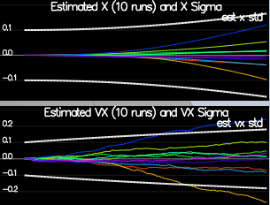
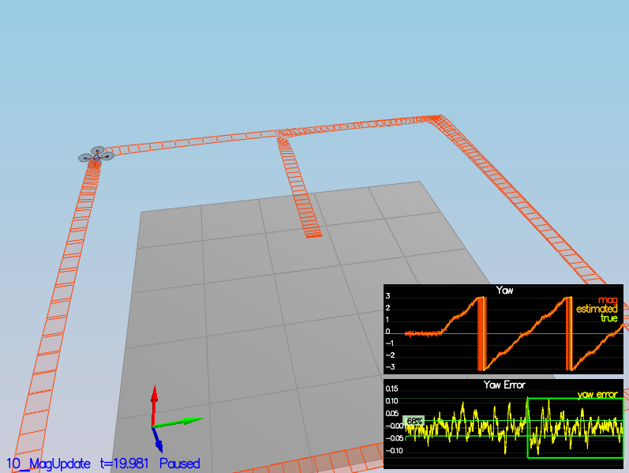

## Project: Estimation
### Andrew Gutierrez, 5/1/21

## Step 1: Sensor Noise


In the first step, a simulation was setup to collect and log data from a set of noisy sensors (GPS and accelerometer). The aim was to calculate the standard deviation of the GPS X position and accelerometer X accel data and update ```MeasuredStdDev_GPSPosXY``` and ```MeasuredStdDev_AccelXY``` in ```config/6_Sensornoise.txt``` with the calculated values. To accomplish this, a simple helper script was added under ```support/readlog.py``` which reads in the data and uses numpy to calculate the stddev of a provided log. Usage of the script follows the form ```python3 readlog.py <PATH_TO_LOG>```.

## Step 2: Attitude Estimation


The next step was implementing a better attitude estimation using an improved integration scheme for the IMU data. This involved updating ```QuadEstimatorEKF::UpdateFromIMU()``` using the included quaternion class. First the roll, pitch and yaw estimates were converted into quaternion form and then ```Quaternion::IntegrateBodyRate()``` was used with the gyro data and IMU timestep to get a new prediction. The resulting quaternion was then converted back to euler angles and the complementary filter scaling was applied to generate a new roll and pitch update. The yaw value is updated directly.

## Step 3: Prediction Step

For the prediction step, changes were made in the ```PredictState()``` function to integrate the state value. Position values were integrated using the velocities and the timestep and the velocities were integrated used the acceleration data transformed into the inertial frame from the body frame. Yaw values are not integrated here as they are handled in the IMU update.

After the state prediction was properly setup, the rbgprime matrix was calculated using equation 52 from [Estimation for Quadrotors](https://www.overleaf.com/read/vymfngphcccj). This matrix was then used to calculate gPrime or the Jacobian of the transition function given by equations 50/51. The resulting gPrime matrix was used in conjunction with the process noise to calculate the new covariance.



## Step 4: Magnetometer Update

The next step was to add the magnetometer data into the way update. This was done in the ```UpdateFromMag()``` function which basically just creates the partial derivative of the sensor model matrix hPrime and passes it along with the measurement and measurement state to the generalized ```Update()``` function. In addition, the current yaw state was normalized to make sure  all turns a kept to less than 180deg. The ```QYawStd``` value was also tuned to reflect the drift of the sensor.

## Step 5: GPS Update:

The final estimation step was implementing the GPS update using simulated data with actual noise. The update was added in ```UpdateFromGPS()``` and like the mag update, is mostly just calculating the hPrime matrix. For the GPS, the hPrime matrix is a pseudo-diagonal matrix of 1s as many of the state values are measured directly. The process noise model did not really need any updates as the provided values worked well from the start.

## Step 6: Adding Your Controller
The last step in the process was swapping out the provided controller for the one created for the previous controls project and re-tuning it to work in the new scenarios with noisy sensors. As suggested, relaxing the position and velocity gains by approximately 30% seemed to work very well and not much else needed change. Overall this was a pretty smooth transition